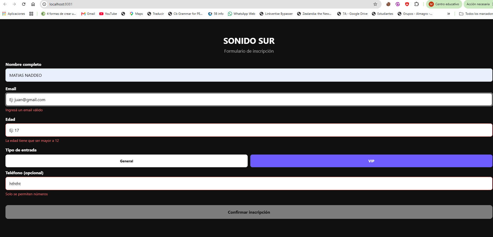
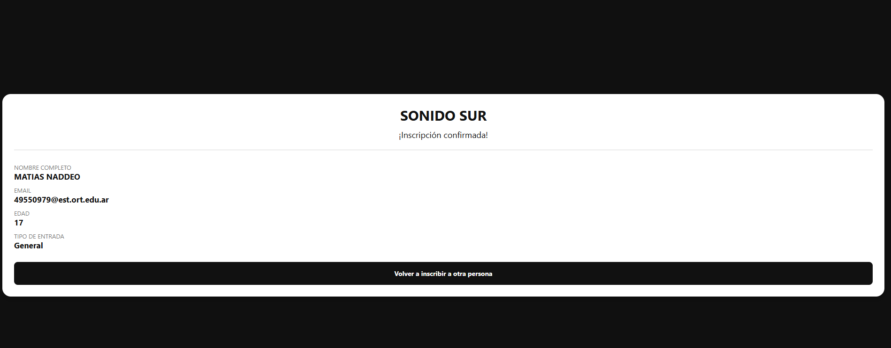

# Sonido Sur - Inscripción

Aplicación de inscripción para el festival ficticio Sonido Sur.

## Cómo correr el proyecto

Desde la raíz del proyecto:

1. `npm install`
2. `npx expo start`

Luego elegí la plataforma con la que quieras probar la app (`web`, `android` o `ios`).

## Forma de validación elegida

Elegí validación con React Hook Form + Controller + rules.

¿Por qué?: porque centraliza la validación en el formulario, permite mostrar errores debajo de cada campo, y hace muy simple deshabilitar el botón "Confirmar inscripción" mientras el formulario no es válido.

## Reglas implementadas

- `nombreCompleto`: obligatorio y mínimo 3 caracteres.
- `email`: obligatorio y con formato válido (`@` y dominio).
- `edad`: obligatoria y entre 13 y 99 (el mensaje mostrado sigue la consigna: "La edad tiene que ser mayor a 12").
- `tipoEntrada`: obligatorio. Solo se aceptan `general` o `vip`.
- `telefono`: opcional; si se completa, solo números.

## Bonus resueltos

- Loading de 1 segundo simulado antes de confirmar la inscripción.
- Persistencia con AsyncStorage del email de la última persona inscripta para precargarlo la próxima vez que se abra la app.

## Capturas a tener en cuenta

La app muestra:

- formulario con errores visibles,
- formulario completo y válido,
- ticket de confirmación con los datos cargados.

